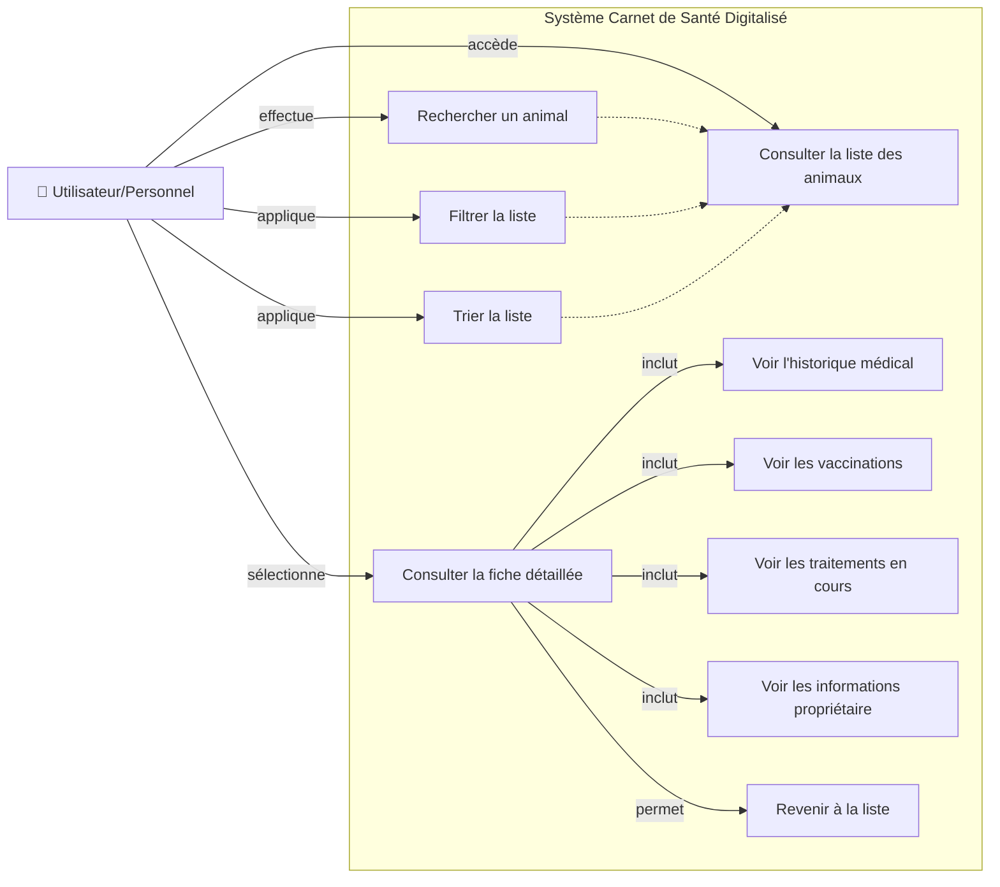

# Louis-Patte-and-cie charie des charges 
# Cahier des Charges
## Carnet de Santé Digitalisé - Clinique Vétérinaire "Patte & Cie"

---

## Titre
Application web de consultation des carnets de santé des animaux pour la clinique vétérinaire "Patte & Cie"

---

## Présentation du projet
La clinique a besoin d'une interface web simple permettant au personnel de consulter rapidement les informations médicales des animaux sans avoir à chercher les dossiers papier. Le site doit offrir une expérience utilisateur fluide et un accès rapide aux informations essentielles.

---

## Objectifs

- Permettre la consultation facile des fiches animaux en ligne
- Afficher l'historique médical complet de chaque animal
- Naviguer rapidement entre la liste et les fiches détaillées

---

## Description des besoins

### 1. Liste des animaux
- Affichage de tous les animaux enregistrés
- Filtres de recherche (nom, espèce, propriétaire)
- Tri par différents critères
- Accès rapide à la fiche détaillée

### 2. Fiche animal détaillée
- Informations générales (nom, espèce, race, date de naissance)
- Informations propriétaire (nom, contact)
- Historique des consultations
- Historique des vaccinations
- Traitements en cours
- Allergies et particularités

### 3. Navigation
- Interface intuitive et claire
- Retour à la liste depuis une fiche
- Chargement dynamique des données

---

## Livrables, Critères de succès, Organisation et déroulement du projet

### Livrables attendus
1. **Documentation de conception**
   - Use Case (Diagram)
   - Dictionnaire de données
   - MCD (MERISE)
   - Fichier(s) JSON mocké(s)

2. **Application web**
   - Page liste des animaux
   - Page fiche détaillée
   - Code HTML/CSS/JS structuré
   - Application déployée en ligne

3. **Présentation**
   - Démo fonctionnelle
   - Explication du modèle de données

### Critères de succès
- ✅ Respect de la maquette Figma
- ✅ Données JSON correctement structurées et chargées
- ✅ Navigation fonctionnelle entre les pages
- ✅ Code propre et bien organisé
- ✅ Application accessible en ligne

### Organisation
- **Étapes** :
  1. Analyse du besoin
  2. Conception (Use Case, Dictionnaire, MCD)
  3. Création des données JSON
  4. Développement (HTML/CSS/JS)
  5. Tests
  6.  Mise en Prod --> Github Pages

# Diagrammes de Cas d'Utilisation - Patte & Cie

## Use Case : Navigation et Consultation (Utilisateur)
